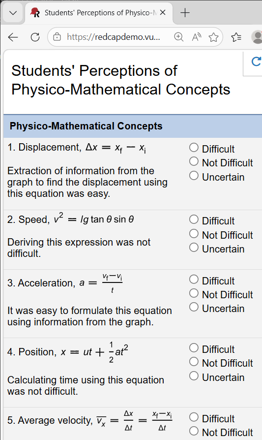

# REDCap-Math-Notation

Rendering LaTeX math notation as images in REDCap online surveys.

REDCap [1, 2] is a platform for managing online data collection. LaTeX-style markup of mathematical notation can be rendered as images for use in REDCap online data collection instruments [4]. This repository provides supporting technical notes and files. Survey questions were drawn from a study of students' perceptions of physico-mathematical concepts [3].

---

<figure style="height:894px;">
  
  <figcaption>Figure 1. REDCap survey with LaTeX-derived mathematical notation. Equations are SVG images generated via LuaLaTeX and pdftocairo.</figcaption>
</figure>

---

### Table of Contents

* [Key Files](#key-files)
* [Software Requirements](#software-requirements)
* [Testing](#testing)
* [Getting Started](#getting-started)
* [Acknowledgments](#acknowledgments)
* [References](#references)

---

### Key Files

- LaTeX/Equation[dd].ltx &nbsp;&nbsp; LaTeX equation generation files.
- Images/Equation[dd].svg &nbsp;&nbsp; Vector graphics rendering of LaTeX equations.
- PhysicoMathematicalConcepts.zip &nbsp;&nbsp; REDCap instrument.

### Software Requirements

- LuaLaTeX.
- REDCap.
- pdftocairo.

LuaLaTeX and pdftocairo are often included in major TeX distributions (e.g., MiKTeX).

### Testing

Testing OS: Windows 11 (version 25H2, OS build 26200.8037).

#### 1. LaTeX/Equation[dd].ltx

Typesetting the LaTeX files was tested with LuaLaTeX, in TeXworks (version 0.6.11), bundled with MiKTeX (version 26.2).

#### 2. Images/Equation[dd].svg

Conversion of LuaLaTeX-output PDF files to SVG files was via pdftocairo (version 24.04.0) at a command line.

#### 3. PhysicoMathematicalConcepts.zip

Import of the instrument file was tested with REDCap version 16.1.1. Note, the links to image resources are specific to a specific REDCap File Repository. They will need modification for your REDCap project, e.g., via the REDCap Online Designer.

Online display of the data collection instrument (a survey) was tested with Microsoft Edge (version 146.0.3856.62).

### Getting Started

#### Mathematics-to-image Rendering

Vector graphics (SVG) files of example equations, for Web display, are available in the Images folder of this repo.

They were generated via a two-step process:

1. LuaLaTeX was used to produce PDF files from LaTeX mathematical markup. The *standalone* document class was used to crop PDF bounds to mathematics content. Example LaTeX files are available in the LaTeX folder of this repo.

2. pdftocairo was used to convert the PDF files to SVG format. Example command line usage of pdftocairo is given below.

```
pdftocairo -svg Equation01.pdf Equation01.svg
```

#### Managing Images

REDCap instruments can be configured to display images online with the REDCap Online Designer. Images can be included in instrument field labels, for example, by specifying a relevant `src` attribute of a HTML `` tag. Target images may be stored remotely, or locally to a REDCap environment via the REDCap File Repository.

#### Example REDCap Survey

An example REDCap data collection instrument (PhysicoMathematicalConcepts.zip) is available in this repo. It demonstrates use of LaTeX to style and typeset mathematical notation online, albeit indirectly, via LaTeX rendered as images.

The instrument ZIP file may be uploaded into a REDCap project.

The associated images are the SVG files in this repo. They may also be uploaded into a REDCap project File Repository, or other remotely accessible location, and associated links updated in Online Designer. Note, the example survey used HTML/CSS for manually fine-tuning equation image sizes and positioning.

#### Font Consistency

In testing the instrument in REDCap, the survey design options were set to use the Arial font. Text in field labels was explicitly set use Arial via the Online Designer. LaTeX files were also configured to output Arial content. Particular font choice is a matter for REDCap instrument designers. Consistency across design elements, such as that described here, is however recommended.

### Acknowledgments

This work used REDCap electronic data capture tools [1, 2]. REDCap (Research Electronic Data Capture) is a secure, web-based software platform designed to support data capture for research studies, providing:

- an intuitive interface for validated data capture,
- audit trails for tracking data manipulation and export procedures,
- automated export procedures for seamless data downloads to common statistical packages, and
- procedures for data integration and interoperability with external sources.

### References

1. P.A. Harris, R. Taylor, et al., "Research electronic data capture (REDCap)&mdash;A metadata-driven methodology and workflow process for providing translational research informatics support", J. Biomed. Inform., 42(2):377&ndash;381, 2009.

2. P.A. Harris, R. Taylor, et al., "The REDCap consortium: Building an international community of software platform partners", J. Biomed. Inform., 95:103208, 2019.

3. K.P. Mwangala, O. Shumba, "Physico-mathematical Conceptual Difficulties among First Year Students Learning Introductory University Physics", Am. J. Educ. Res., 4(17):1238&ndash;1244, 2016.

4. T. Stenborg, "Mathematical notation in REDCap online data collection instruments", TUGboat, 47(1) (in prep), 2026.
